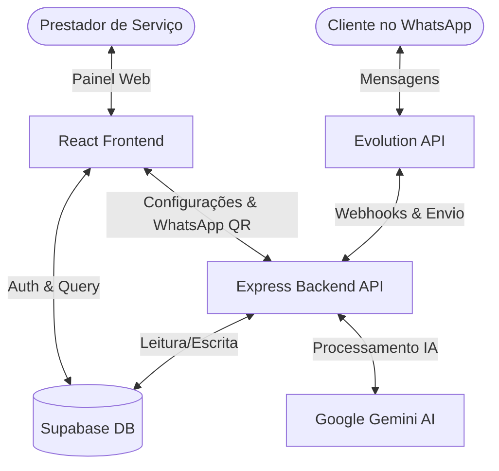

# Documentação Técnica: Atendente (Recepcionista IA)

O **Atendente** é uma recepcionista inteligente via Inteligência Artificial que atende, tria e agenda atendimentos automaticamente pelo WhatsApp integrado ao ecossistema **Controle Total**.

---

## 1. Visão Geral da Arquitetura

O sistema é dividido em três camadas principais:
1. **Frontend (SPA)**: Aplicação React + TypeScript construída com Vite, estilizada com Tailwind CSS e shadcn/ui.
2. **Backend (Express API)**: Servidor Node.js em TypeScript que atua como orquestrador, gerenciando conexões com a Evolution API (WhatsApp) e integrando com o Google Gemini.
3. **Banco de Dados (Supabase)**: Banco relacional PostgreSQL contendo tabelas compartilhadas com o ecossistema Controle Total, além de armazenamento de sessões e autenticação.



---

## 2. Estrutura do Projeto

```
atendente/
├── server/                 # Express Backend API
│   ├── src/
│   │   ├── config.ts       # Carregamento de variáveis de ambiente
│   │   ├── index.ts        # Ponto de entrada do Express
│   │   ├── lib/            # Clientes externos (Supabase, Gemini, Evolution)
│   │   ├── middlewares/    # Middleware de Autenticação JWT
│   │   ├── routes/         # Endpoints REST (auth, instances, messages, webhook)
│   │   └── services/       # Lógicas de processamento de mensagens e fila
│   └── tsconfig.json
│
├── src/                    # React Frontend App
│   ├── components/         # Componentes reutilizáveis e UI (shadcn)
│   ├── contexts/           # Provedores de estado global (Auth, Account)
│   ├── hooks/              # Custom hooks (e.g. useCalendarIntegration)
│   ├── integrations/       # Cliente auto-gerado do Supabase
│   ├── lib/                # Funções utilitárias e constantes
│   ├── pages/              # Telas (Auth, Onboarding, Index, Dashboard)
│   └── App.tsx             # Definição de rotas e layout
```

---

## 3. Banco de Dados & Schema

O banco de dados é hospedado no Supabase. Tabelas relevantes:

- **`profiles`**: Dados cadastrais dos usuários prestadores de serviço (compartilhado com Controle Total).
- **`products`** & **`account_products`**: Controla os acessos e produtos ativos contratados por cada conta no ecossistema.
- **`evolution_instances`**: Registra as conexões e instâncias de WhatsApp criadas na Evolution API para cada conta.
- **`conversations`**: Chats abertos com clientes no WhatsApp.
- **`messages`**: Histórico completo de mensagens trocadas com cada cliente.
- **`message_queue`**: Fila de mensagens pendentes de processamento de envio via WhatsApp.

---

## 4. Fluxo de Autenticação & Cadastro Integrado

Durante o cadastro ou acesso à plataforma:

1. **Validação de E-mail**: Ao submeter o formulário de cadastro, o frontend considera a resposta de `/auth/check-email?email=...` no Express Backend.
2. **Checagem de Produtos**:
   - Se o usuário já possui o produto **Atendente** ativo, o cadastro é barrado e ele é instruído a fazer login.
   - Se ele possui cadastro apenas no **Controle Total**, ele é informado de que está adicionando o Atendente como produto adicional e instruído a fazer login usando suas credenciais atuais.
3. **Onboarding**: Ao logar, se o onboarding não estiver completo, o usuário é direcionado para a página de Onboarding, que pré-carrega todas as informações cadastrais já preenchidas no Controle Total.

---

## 5. Integração com WhatsApp (Evolution API)

- **Instâncias**: Cada conta possui uma instância única na Evolution API (`atd_[account_id_resumido]`).
- **Conexão**: O frontend exibe um QR Code gerado pelo endpoint `/instances/:instanceId/connect` do Express, permitindo o pareamento seguro do aparelho comercial.
- **Recebimento de Mensagens**: Webhooks da Evolution API batem na rota `/webhook` do backend, disparando o processador de IA em segundo plano.

---

## 6. Processamento de Mensagens & IA (Gemini)

Quando o cliente envia uma mensagem:
1. O webhook registra a mensagem em `messages` e atualiza a conversa em `conversations`.
2. O backend executa o **Gemini AI** (`server/src/lib/gemini.ts`) alimentado pelo prompt de persona do Atendente configurado pelo prestador.
3. A resposta gerada é inserida na fila `message_queue` com o status `pending`.
4. O processador de fila (`server/src/services/queue.ts`) consome as mensagens pendentes e envia de volta ao cliente via Evolution API.

---

## 7. Tratamento de Segurança e RLS (Row Level Security)

- **Tratamento de Exceções Resilientes**: O frontend implementa uma camada de tratamento de exceções ao registrar produtos na inicialização (arquivo [AccountContext.tsx](file:///Users/joel/projetos/atendente/src/contexts/AccountContext.tsx)). Caso políticas de RLS ou restrições de banco impeçam a escrita imediata na tabela `account_products`, o fluxo captura o erro de forma silenciosa e ativa o produto em nível de memória da aplicação. Isso evita travamentos ou loops de logout com a mensagem de assinatura inativa.
- **Redirecionamento Inteligente de Onboarding**: O fluxo de onboarding (arquivo [Onboarding.tsx](file:///Users/joel/projetos/atendente/src/pages/Onboarding.tsx)) possui uma verificação ativa de estado. Se o perfil logado já possui a propriedade `onboarding_completo = true`, ele é redirecionado instantaneamente de `/onboarding` para `/admin`, mitigando loops causados por recargas manuais de tela ou redirecionamentos de rotas.

---

## 8. Central de Ajuda & FAQ Dinâmico

A central de ajuda (arquivo [Suporte.tsx](file:///Users/joel/projetos/atendente/src/pages/dashboard/Suporte.tsx)) fornece um FAQ categorizado e interativo que permite ao usuário final sanar dúvidas sobre os seguintes módulos:
- **WhatsApp e Conexão**: Dúvidas sobre leitura de QR Code, pareamento, uso conjunto do WhatsApp Web e contas Business.
- **Recepcionista IA**: Regras de silenciamento de grupos/conversas pessoais e customização de persona e idioma.
- **Agendamentos**: Regras de conflitos de horários na agenda do Controle Total e solicitações de reagendamento/cancelamento por clientes.
- **Clientes e Conversas**: Monitoramento e intervenção manual em tempo real.
- **Configurações e Conta**: Detalhes sobre a contratação integrada do produto e privacidade dos dados sob a LGPD.

O componente possui filtragem em tempo real que atua tanto nas abas de categorias quanto em consultas do campo de busca textual.
