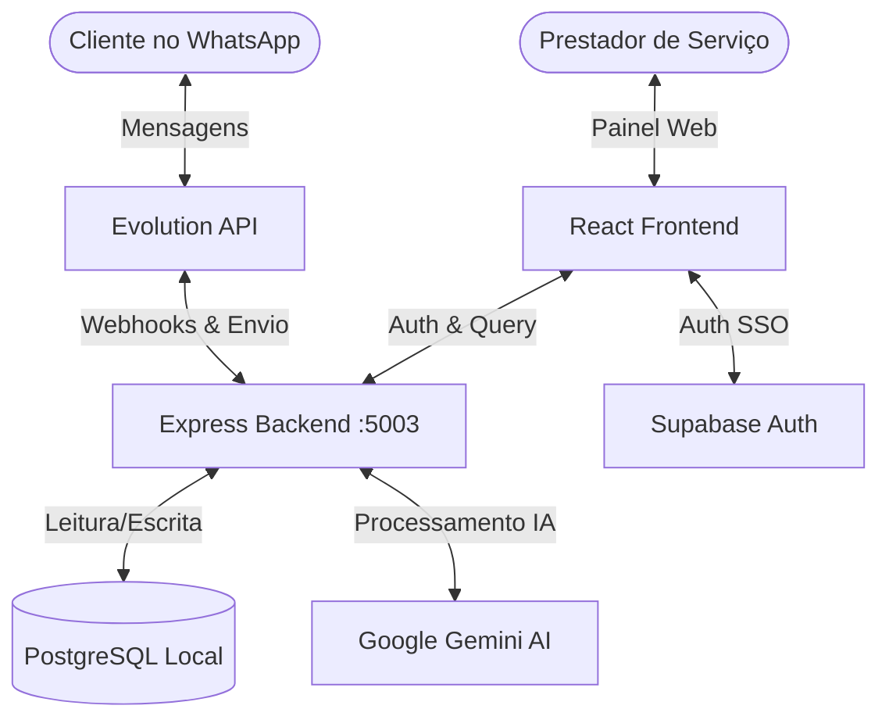

# Documentação Técnica: Atendente (Recepcionista IA)

O **Atendente** é uma recepcionista inteligente via Inteligência Artificial que atende, tria e agenda atendimentos automaticamente pelo WhatsApp, integrado ao ecossistema **Controle Total**.

---

## 1. Visão Geral da Arquitetura

O sistema é dividido em três camadas principais:
1. **Frontend (SPA)**: Aplicação React + TypeScript (Vite + Tailwind + shadcn/ui).
2. **Backend (Express API)**: Servidor Node.js em TypeScript que orquestra conexões Evolution API (WhatsApp) e Google Gemini.
3. **Banco de Dados (PostgreSQL local)**: Banco relacional PostgreSQL rodando no próprio VPS, com tabelas compartilhadas com o ecossistema Controle Total.



**Diferenças do modelo anterior:**
- ✅ Substituído cliente Supabase JS por **QueryBuilder próprio** (`src/integrations/db/client.ts`)
- ✅ Autenticação via Supabase REST (sem client JS pesado)
- ✅ Banco PostgreSQL acessado diretamente pelo backend via `pg` pool

---

## 2. Estrutura do Projeto

```
atendente/
├── server/                    # Express Backend API
│   ├── src/
│   │   ├── config.ts          # Variáveis de ambiente
│   │   ├── index.ts           # Entrada Express (porta 5003)
│   │   ├── lib/
│   │   │   ├── db.ts          # QueryBuilder + auth JWT (servidor)
│   │   │   ├── evolution.ts   # Cliente Evolution API
│   │   │   ├── gemini.ts      # Google Gemini + prompts + retry
│   │   │   └── products.ts    # Product tiers (basic/complete)
│   │   ├── middlewares/
│   │   │   └── auth.ts        # Auth middleware (JWT)
│   │   ├── routes/
│   │   │   ├── auth.ts        # Login, register, check-email, me
│   │   │   ├── webhook.ts     # Webhook Evolution API
│   │   │   ├── instances.ts   # CRUD instâncias WhatsApp
│   │   │   ├── messages.ts    # Conversas e mensagens
│   │   │   ├── dashboard.ts   # Dashboard metrics
│   │   │   ├── agenda.ts      # Disponibilidade e slots
│   │   │   └── data.ts        # CRUD genérico (proxy DB)
│   │   └── services/
│   │       ├── messageHandler.ts  # Pipeline principal de IA
│   │       ├── queue.ts           # Fila de envio WhatsApp
│   │       ├── postVenda.ts       # Pós-venda automático
│   │       ├── lembrete.ts        # Lembretes de agendamento
│   │       └── leadQualificator.ts # Qualificação de leads
│   └── tsconfig.json
│
├── src/                       # React Frontend App
│   ├── components/            # UI (shadcn) e layouts
│   ├── contexts/
│   │   ├── AuthContext.tsx    # Auth provider (SSO + JWT local)
│   │   └── AccountContext.tsx # Profile + products
│   ├── integrations/
│   │   └── db/
│   │       └── client.ts     # QueryBuilder frontend
│   ├── pages/
│   │   └── dashboard/
│   │       ├── Dashboard.tsx     # Métricas + próximos passos
│   │       ├── Conversas.tsx     # Chat em tempo real
│   │       ├── Agenda.tsx        # Agenda dia/semana/mês
│   │       ├── Configuracoes.tsx # Abas: IA, Horários, Serviços
│   │       └── Suporte.tsx       # FAQ dinâmico
│   └── App.tsx               # Rotas
├── PRODUCT.md                # Documentação do produto
├── deploy.sh                 # Script de deploy
└── docs/
    └── documentacao-tecnica.md  # Este documento
```

---

## 3. Banco de Dados

Banco PostgreSQL local (`controletotal`), acessado via pool de conexões diretas.

### Tabelas principais

| Tabela | Finalidade |
|--------|-----------|
| `profiles` | Dados cadastrais dos usuários (compartilhado c/ Controle Total) |
| `auth.users` | Usuários de autenticação (compartilhado c/ Controle Total via Supabase) |
| `account_products` | Produtos contratados por conta |
| `evolution_instances` | Instâncias WhatsApp conectadas |
| `conversations` | Chats abertos com clientes |
| `messages` | Histórico de mensagens |
| `message_queue` | Fila de mensagens pendentes de envio |
| `ia_configs` | Configurações de comportamento da IA (autonomia, deslocamento, campos) |
| `business_hours` | Horários de funcionamento (7 dias, abertura/fechamento) |
| `servicos_catalogo` | Catálogo de serviços (nome, duração, preço) |
| `agendamentos` | Agendamentos criados pela IA ou manualmente |
| `orcamentos` | Orçamentos aprovados (pós-venda) |
| `clientes` | Clientes captados pela IA |
| `leads` | Leads qualificados (tier complete) |

### Colunas específicas

**`ia_configs`** — `account_id` (PK), `autonomy_level` (full/screening/manual), `collect_*`, `custom_instructions`, `greeting_message`, `closing_message`, `deslocamento_minutos` (default 30)

**`servicos_catalogo`** — `id`, `user_id`, `nome`, `duracao_minutos` (nullable), `valor_padrao`, `ativo`

**`agendamentos`** — `hora_inicio`, `hora_fim` (calculado dinamicamente pela duração do serviço), `observacoes` (inclui deslocamento)

---

## 4. Autenticação

### Fluxo SSO (Controle Total)
1. Usuário loga no Controle Total → clica "Atendente"
2. Redireciona para `https://atendente.controletotal.app/?token=xxx`
3. `AuthContext` captura token → `db.auth.setSession()` salva no `localStorage`
4. `getSession()` decodifica JWT localmente (sem verificar assinatura)

### Fluxo Local (Login direto)
1. POST `/api/auth/login` → valida email+senha na tabela `auth.users`
2. Retorna JWT assinado com `JWT_SECRET` (7 dias de expiração)
3. Frontend salva no `localStorage` via `signInWithPassword`

### Middleware de Autenticação
- Backend verifica JWT com `jwt.verify(token, JWT_SECRET)` no middleware `auth.ts`
- Extrai `id` e `sub` do payload → define `req.user`

---

## 5. Integração WhatsApp (Evolution API)

- **Instância**: `atd_[12 primeiros chars do account_id]` (ex: `atd_8991d4b23ab4`)
- **Conexão**: QR Code gerado pelo endpoint `/instances/:id/connect`
- **Webhook**: Evolution API envia eventos `MESSAGES_UPSERT` + `CONNECTION_UPDATE` para `/webhook`
- **Envio**: `sendMessage(instanceName, remoteJid, text)` via REST Evolution API

### Pipeline de Mensagens

```
Webhook → handleIncomingMessage → storeMessage → loadHistory → 
loadIaConfig → loadBusinessHours → loadServicos → 
generateResponse (Gemini) → sendAndStore → tryCriarAgendamento → 
notificarDono
```

---

## 6. Processamento de IA (Gemini)

### Prompt
- Construído em `buildSystemPrompt()` com: persona, regras, horários, serviços, autonomia, instruções customizadas
- **Injetado como primeira mensagem do chat** (não como `systemInstruction` — mais confiável)
- A IA confirma com "OK, entendi todas as regras. Estou pronta para atender."

### Modelos com Fallback
```typescript
const models = ["gemini-2.5-flash", "gemini-2.5-flash-lite", "gemini-flash-latest"];
```
- Cada modelo: 2 tentativas de 15s cada
- Se 503/timeout → backoff 500ms → próximo modelo
- Log de erros inesperados (não só 503)

### Segurança (Dupla Checagem)
1. **Em `gemini.ts`**: se resposta contém "alguém vai", "vai retornar" ou "recebi sua mensagem", descarta e tenta próximo modelo
2. **Em `messageHandler.ts`**: mesma verificação ANTES de armazenar a resposta → se pegar, envia fallback amigável

### Histórico Filtrado
- `loadHistory()` filtra mensagens da IA com `BAD_PATTERNS` (frases proibidas)
- O Gemini nunca recebe exemplos negativos no prompt para não copiá-los

---

## 7. Agendamento Automático

### Marcador no Prompt
A IA inclui no final da resposta:
```
📅 AGENDAR|servico|data|horario|deslocamento
```
Campos: `serviço`, `data` (YYYY-MM-DD), `horário` (HH:MM), `deslocamento` (minutos, opcional)

### Processamento (`tryCriarAgendamento`)
1. Regex captura o marcador
2. Carrega `deslocamento_minutos` da `ia_configs` (ou do marcador)
3. Busca `duracao_minutos` do serviço no catálogo
4. Calcula `hora_fim = hora_inicio + duracao_minutos`
5. Insere em `agendamentos` com `observacoes: "Deslocamento: X min"`
6. Retorna objeto com `deslocamento_minutos` incluso

### Disponibilidade (`GET /agenda/disponibilidade`)
- Slots calculados com base no **maior serviço** + **deslocamento**
- Conflitos checados contra agendamentos existentes (não cancelados)
- Retorna `deslocamento_minutos` e `duracao_slot` no response

### Notificação ao Dono
- Após criar agendamento, `notificarDono()` envia WhatsApp para o telefone do perfil
- Mensagem inclui: cliente, serviço, data, horário, deslocamento, previsão de saída

---

## 8. Dashboard & Cache

- `loadAll()` faz fetch de `/api/dashboard/status` e `/api/instances/:id`
- **Cache em `sessionStorage`**: última resposta bem-sucedida é salva como `dashboard:status` e `dashboard:connected`
- **Fallback**: se API falhar, usa cache
- **Estado triplo do WhatsApp**: Conectado / Desconectado / Indisponível (falha na API)
- **Próximos passos**: "Conectar WhatsApp" só aparece se API confirmou desconexão
- Polling automático a cada 30s + botão "Atualizar"

---

## 9. Catálogo de Serviços Lite

Nova aba em Configuracoes > Serviços.

**Funcionalidades:**
- Lista de serviços com nome, duração, preço e toggle ativo
- Adicionar: formulário inline com 3 campos (nome, duração, preço)
- Editar: botão de lápis por serviço
- Excluir: botão de lixeira com confirmação
- CRUD via `/api/db/servicos_catalogo` (rota genérica já existente)

**O que NÃO tem (para não canibalizar Controle Total):**
- ❌ Categorias, tags, descrição longa, imagens
- ❌ Variações de preço, comissão, custo, SKU
- ❌ Estoque, vitrine, promoções

---

## 10. PM2 & Deploy

### PM2
```bash
pm2 delete atendente-api
pm2 start /var/www/atendente-server/dist/index.js --name atendente-api
pm2 save
```
- Processo: `atendente-api` (fork), porta 5003
- Nginx: `/api/` → `localhost:5003/`, `/webhook` → `localhost:5003`

### Nginx
```nginx
location /api/ {
    proxy_pass http://localhost:5003/;
}
location /webhook {
    proxy_pass http://localhost:5003;
}
```
- Assets em `/assets/` têm `Access-Control-Allow-Origin: *` (necessário para `crossorigin` do Vite)
- `index.html` não é cacheado (`no-cache, no-store`)

### Frontend
```bash
export VITE_API_URL="https://atendente.controletotal.app"
export VITE_API_BASE_URL="https://atendente.controletotal.app/api"
npm run build
rsync -avz --delete dist/ root@187.127.12.245:/var/www/atendente/
```

---

## 11. Product Tiers

| Funcionalidade | Basic | Complete |
|---------------|-------|----------|
| IA atende clientes | ✅ | ✅ |
| Agenda automática | ✅ | ✅ |
| Preços no catálogo | ❌ (informa "sob avaliação") | ✅ (mostra valor) |
| Análise de fotos | ❌ (pede descrição) | ✅ (pré-diagnóstico) |
| Lead qualification | ❌ | ✅ |
| Descontos recorrentes | ❌ | ✅ |

---

## 12. Solução de Problemas Comuns

### Dashboard mostra "Indisponível" no WhatsApp
- API de instâncias retornou erro (401/token inválido)
- Cache anterior de "Conectado" seria usado se disponível
- Clique em "Atualizar" ou recarregue a página

### IA responde com "alguém vai retornar"
- Dupla checagem de segurança bloqueia e envia fallback
- Se persistir, verifique `BAD_PATTERNS` em `messageHandler.ts`

### PM2 status "errored"
- Resetar: `pm2 delete atendente-api && pm2 start dist/index.js --name atendente-api`
- Ocorre quando restarts excedem `max_restarts`

### Página em branco (frontend)
- Hard refresh (Cmd+Shift+R) para limpar cache
- Verificar se bundle JS tem `Access-Control-Allow-Origin`
- Erro `Clock is not defined` → import ausente em Configuracoes.tsx

### Agendamento não cria na agenda
- Verificar se marcador `📅 AGENDAR|...` está no final da resposta da IA
- Verificar regex `AGENDAR_REGEX` em `messageHandler.ts`
- Verificar se `servicos_catalogo` tem o serviço com `duracao_minutos`
